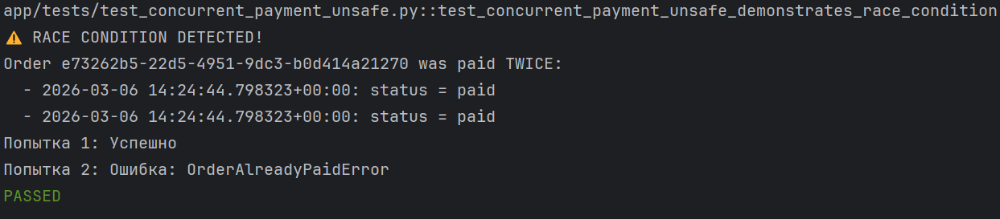
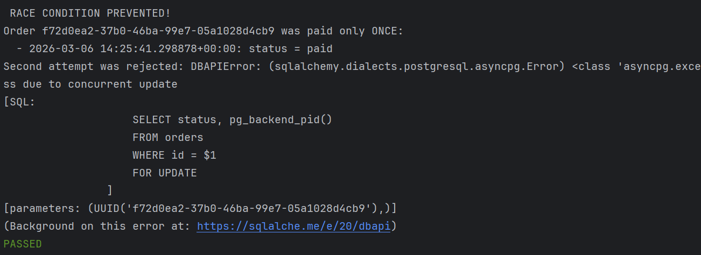

# Отчёт по лабораторной работе №2
## Управление конкурентными транзакциями в маркетплейсе

**Студент:** _[Гаврилюк А.В.]_  
**Дата:** _[06.03.2026]_

---

## Раздел 1: Описание проблемы

### Что такое Race Condition?

Race condition (состояние гонки) — это ситуация, когда результат выполнения программы зависит от того, в каком порядке и с какой скоростью выполняются операции в параллельных транзакциях.

**Пример из жизни:**
У пользователя произошел сбой с подключением к интернету и пришло два вызова оплаты товара — в итоге двойная оплата одного заказа.

### Почему READ COMMITTED не защищает от двойной оплаты?

На уровне изоляции READ COMMITTED:
1. Каждая транзакция видит только закоммиченные данные на момент начала
2. Когда две транзакции одновременно читают статус 'created', обе не видят проблемы
3. В результате обе выполняют UPDATE и INSERT в историю.

**Демонстрация проблемы:**

```
Время | Сессия 1                    | Сессия 2
------|----------------------------|---------------------------
t1    | BEGIN                      |
t2    | SELECT status (created)    |
t3    |                            | BEGIN
t4    |                            | SELECT status (created)
t5    | pg_sleep(3)                |
t6    |                            | pg_sleep(3)
t7    | UPDATE status = paid       |
t8    |                            | UPDATE status = paid (ждет)
t9    | COMMIT                     |
t10   |                            | UPDATE выполняется...
t11   |                            | COMMIT
```

На этапах t1-t4 две параллельные транзакции начинают работу и читают статус заказа. Поскольку используется уровень изоляции READ COMMITTED, а заказ еще не оплачен, обе сессии видят статус 'created'.

На этапах t5-t6 в системе возникает искусственная задержка, моделирующая выполнение приложением других операций перед обновлением данных.

На этапе t7 первая сессия обновляет статус на 'paid'. На эту строку накладывается блокировка, но транзакция пока не завершена.

На этапе t8 вторая сессия пытается выполнить свой UPDATE. PostgreSQL автоматически приостанавливает ее выполнение, заставляя ожидать освобождения блокировки, удерживаемой первой транзакцией.

На этапе t9 первая сессия успешно фиксирует изменения (COMMIT), и блокировка снимается.

На этапе t10 вторая сессия получает доступ к строке и выполняет свой UPDATE. Из-за особенностей уровня READ COMMITTED операция не перечитывает данные заново — она просто применяет изменения к текущей версии строки.

На этапе t11 вторая сессия завершает транзакцию (COMMIT). В итоге в системе оказываются зафиксированными две записи об оплате одного и того же заказа.

### Примеры из реальной жизни

_TODO: Приведите реальные примеры, когда может возникнуть такая проблема._

1. **Двойной клик на кнопку "Оплатить"**
   - Пользователь нажимает кнопку дважды
   - Два HTTP-запроса приходят почти одновременно
   - Оба запроса начинают обработку параллельно

2. **Микросервисная архитектура**
   - Система состоит из нескольких реплик сервиса оплаты
   - Два разных инстанса одновременно получают запрос на оплату одного заказа
   - Оба проверяют статус заказа, видят 'created' и начинают списание средств

3. **Сбой сети**
   - Клиент отправил запрос на оплату, но не получил ответ из-за таймаута
   - Пользователь нажимает "Оплатить" снова (считая, что первый запрос не прошел)
   - Первый запрос на самом деле успешно дошел и начал обрабатываться
   - Второй запрос запускается параллельно с первым

---

## Раздел 2: Уровни изоляции в PostgreSQL

### READ UNCOMMITTED

**Описание:**
Самый низкий уровень изоляции, позволяющий читать незакоммиченные изменения других транзакций (dirty reads).

**Предотвращает:**
Ничего не предотвращает

**Не предотвращает:**
- Dirty reads
- Non-repeatable reads
- Phantom reads

**Когда использовать:**
Может применяться в системах, где скорость важнее консистентности данных, и допустимы расхождения.

**Особенность в PostgreSQL:**
В PostgreSQL READ UNCOMMITTED работает как READ COMMITTED из-за архитектуры MVCC.

---

### READ COMMITTED (по умолчанию)

**Описание:**
Каждый SELECT в транзакции видит только те данные, которые были закоммичены до начала выполнения запроса.

**Предотвращает:**
- ✅ Dirty reads (чтение незакоммиченных данных)

**Не предотвращает:**
- ❌ Non-repeatable reads (повторное чтение дает другой результат)
- ❌ Phantom reads (новые строки появляются в результате запроса)

**Пример non-repeatable read:**
```sql
-- Сессия 1
BEGIN;
SELECT balance FROM accounts WHERE id = 1; -- Результат: 1000
-- Сессия 2 изменяет balance и делает COMMIT
SELECT balance FROM accounts WHERE id = 1; -- Результат: 500 (!)
COMMIT;
```

**Когда использовать:**
Стандартный выбор для большинства приложений. Подходит для сценариев, где допустимо изменение данных между запросами в одной транзакции (например, отчеты, где важна актуальность на момент каждого запроса).

---

### REPEATABLE READ

**Описание:**
Транзакция видит snapshot данных на момент первого запроса. Все последующие чтения внутри транзакции видят те же данные.

**Предотвращает:**
- ✅ Dirty reads
- ✅ Non-repeatable reads
- ✅ Phantom reads (в PostgreSQL благодаря MVCC)

**Не предотвращает:**
- ❌ Write skew (специфичная аномалия)
- ❌ Некоторые сериализационные аномалии

**Особенность в PostgreSQL:**
В отличие от стандарта SQL, PostgreSQL на REPEATABLE READ также предотвращает phantom reads.

**Когда использовать:**
Для сложных отчетов и финансовых операций, где важна консистентность данных в рамках одной транзакции (например, формирование выписок, аудит).

---

### SERIALIZABLE

**Описание:**
Самый строгий уровень изоляции, гарантирующий, что транзакции выполняются так, как если бы они шли последовательно (одна за другой), даже если физически они выполнялись параллельно.

**Предотвращает:**
- ✅ Все аномалии чтения
- ✅ Сериализационные аномалии
- ✅ Write skew

**Недостатки:**
- ❌ Может откатывать транзакции при конфликтах (serialization failure)
- ❌ Снижение производительности
- ❌ Требует retry logic в приложении

**Пример serialization failure:**
```sql
-- Сессия 1
BEGIN ISOLATION LEVEL SERIALIZABLE;
SELECT SUM(balance) FROM accounts; -- 5000
UPDATE accounts SET balance = balance + 100 WHERE id = 1;

-- Сессия 2 (параллельно)
BEGIN ISOLATION LEVEL SERIALIZABLE;
SELECT SUM(balance) FROM accounts; -- 5000
UPDATE accounts SET balance = balance + 200 WHERE id = 2;

-- При COMMIT одна из транзакций получит ошибку:
-- ERROR: could not serialize access due to read/write dependencies
```

**Когда использовать:**
Для критически важных операций, где абсолютно недопустимы противоречия: финансовые транзакции, бронирования (билеты/отели), аукционы, инвентаризация.

---

### Сравнительная таблица

| Уровень изоляции  | Dirty Read | Non-Repeatable Read | Phantom Read | Performance | Use Case |
|-------------------|------------|---------------------|--------------|-------------|----------|
| READ UNCOMMITTED  | ❌          | ❌                   | ❌            | Высокая     | Аналитика (неточная) |
| READ COMMITTED    | ✅          | ❌                   | ❌            | Высокая     | Обычные операции |
| REPEATABLE READ   | ✅          | ✅                   | ✅*           | Средняя     | Критичные операции |
| SERIALIZABLE      | ✅          | ✅                   | ✅            | Низкая      | Финансовые транзакции |

_*В PostgreSQL REPEATABLE READ также предотвращает phantom reads благодаря MVCC._

---

## Раздел 3: Решение проблемы

### Почему REPEATABLE READ решает проблему?

REPEATABLE READ использует snapshot isolation:
1. Транзакция видит снапшот данных на момент первого запроса, а не на момент каждого отдельного SELECT
2. Это означает, что вторая транзакция не увидит изменений, сделанных первой, даже если первая уже закоммитилась
3. Однако, без блокировок проблема остается - обе транзакции видят статус 'created' в своих snapshot'ах и выполнят UPDATE
4. Во время UPDATE у второй транзакции возникнет ошибка сериализации, ведь после коммита первой, PostgreSQL увидит что строка изменена.


### Зачем нужен FOR UPDATE?

- FOR UPDATE гарантирует, что только одна транзакция сможет прочитать и изменить строку в данный момент времени

- Без FOR UPDATE обе транзакции читают статус одновременно и только в момент UPDATE одна получает ошибку

- С FOR UPDATE вторая транзакция блокируется на SELECT и ждет, пока первая не завершится

- После освобождения блокировки вторая транзакция видит актуальный статус 'paid' и выбрасывает исключение без попытки UPDATE

`FOR UPDATE` создает эксклюзивную блокировку на уровне строки (row-level lock):

**Без FOR UPDATE:**
```sql
BEGIN ISOLATION LEVEL REPEATABLE READ;
SELECT status FROM orders WHERE id = '...';
-- Другая транзакция может прочитать ту же строку
UPDATE orders SET status = 'paid' WHERE id = '...';
COMMIT;
```

**С FOR UPDATE:**
```sql
BEGIN ISOLATION LEVEL REPEATABLE READ;
SELECT status FROM orders WHERE id = '...' FOR UPDATE;
-- Другая транзакция ЖДЕТ освобождения блокировки
UPDATE orders SET status = 'paid' WHERE id = '...';
COMMIT;
```

**Типы блокировок:**
- `FOR UPDATE` — эксклюзивная блокировка (никто не может изменить или заблокировать)
- `FOR SHARE` — разделяемая блокировка (другие могут читать с FOR SHARE, но не могут изменять)
- `FOR NO KEY UPDATE` — как FOR UPDATE, но разрешает concurrent FOR KEY SHARE
- `FOR KEY SHARE` — слабая блокировка (предотвращает DELETE и UPDATE ключевых полей)

### Что произойдет без FOR UPDATE на REPEATABLE READ?

_TODO: Опишите сценарий, когда REPEATABLE READ без FOR UPDATE не работает._

Даже на REPEATABLE READ возможна аномалия:

```sql
-- Сессия 1
BEGIN ISOLATION LEVEL REPEATABLE READ;
SELECT status FROM orders WHERE id = '...'; -- created
-- Задержка...
UPDATE orders SET status = 'paid' WHERE id = '...' AND status = 'created';
COMMIT;

-- Сессия 2 (параллельно)
BEGIN ISOLATION LEVEL REPEATABLE READ;
SELECT status FROM orders WHERE id = '...'; -- created (snapshot!)
-- Задержка...
UPDATE orders SET status = 'paid' WHERE id = '...' AND status = 'created';
-- ЧТО ПРОИЗОЙДЕТ?
```

Сессия 2 попытается выполнить UPDATE, но PostgreSQL увидит, что строка была изменена после создания снапшота

Сессия 2 получит ошибку: "could not serialize..."

Заказ останется оплаченным только один раз

НО:

Ошибка сериализации требует обработки в коде (retry logic)

Вторая транзакция все равно пыталась обновить данные, хотя могла бы сразу понять, что заказ уже оплачен

При высокой нагрузке будет много откатов и повторных попыток

### Разница между FOR UPDATE и FOR SHARE

| Характеристика | FOR UPDATE | FOR SHARE |
|----------------|------------|-----------|
| Тип блокировки | Эксклюзивная | Разделяемая |
| Блокирует чтение с FOR UPDATE | ✅ | ✅ |
| Блокирует чтение с FOR SHARE | ✅ | ❌ |
| Блокирует UPDATE | ✅ | ✅ |
| Блокирует DELETE | ✅ | ✅ |
| Use case | Перед изменением | Защита от изменений |

**Пример использования FOR SHARE:**
```sql
-- Проверка наличия товара перед созданием заказа
SELECT quantity FROM products WHERE id = '...' FOR SHARE;
-- Товар не может быть удален или изменен до COMMIT
```

---

## Раздел 4: Рекомендации для продакшена

### Какой ISOLATION LEVEL использовать для продакшена маркетплейса?

**Рекомендация:** Для продакшена маркетплейса рекомендуется использовать **READ COMMITTED как default уровень** с явным использованием **REPEATABLE READ + FOR UPDATE для критичных операций**.

#### Обоснование:

**1. Производительность**
- READ COMMITTED имеет минимальный overhead, так как не требует отслеживания фантомных записей и проверки сериализации, что снижает нагрузку на CPU+RAM
- REPEATABLE READ используется только там, где необходимо, то есть блокировки READ COMMITTED удерживаются минимальное время (на время запроса, а не транзакции), что уменьшает простои
- Избегаем глобального использования SERIALIZABLE, которое может приводить к массовым откатам из-за сериализационных конфликтов

**2. Безопасность данных**
- Критичные операции (оплата, изменение баланса) защищены через REPEATABLE READ + FOR UPDATE, значит данные не будут изменены другой транзакцией
- Некритичные операции (просмотр каталога) работают на READ COMMITTED, исключая риск долгих блокировок при простом просмотре данных
- Четкое разделение зон ответственности, разработчик четко отмечает опасные участки кода.

**3. Риски deadlock**
- FOR UPDATE может привести к deadlock при неправильном порядке блокировок, например, когда две транзакции пытаются заблокировать один и те же таблицы в разной последовательности.
- Решение: всегда блокировать ресурсы в одном порядке, внедрив некий стандарт, по которому будут идти транзакции.
- Пример: сначала order, потом order_items, потом payment.

**4. Простота разработки**
- READ COMMITTED легко понять и отлаживать. Разработчик видит последние зафиксированные данные, нет путаницы с фантомным чтением в простых SELECT-запросах. 
- REPEATABLE READ + FOR UPDATE требует explicit intent
- Код становится самодокументируемым. Любой новый разработчик сразу видит критичные участки и понимает где высокая конкуренция за ресурсы.

**5. Масштабируемость**
- READ COMMITTED хорошо масштабируется горизонтально, так как БД тратит меньше ресурсов на координацию между репликами и синхронизацию между снапшотами.
- Локальное использование блокировок не создает bottleneck - блокируются только конкретные строки, а не таблицы или схемы.
- Connection pooling работает эффективно, так как транзакции завершаются быстро из-за отсутствия долгих блокировок на чтение.

### Альтернативные подходы

#### Подход 1: Использовать SERIALIZABLE везде

**Плюсы:**
- Максимальная корректность
- Не нужно думать о блокировках
- PostgreSQL автоматически обнаруживает конфликты

**Минусы:**
- Значительное снижение производительности (20-50%)
- Требует retry logic во всех операциях
- Высокий процент rollback при нагрузке
- Сложная отладка serialization failures

**Вывод:** Не рекомендуется для high-load систем.

#### Подход 2: Optimistic Locking (версионирование)

**Реализация:**
```sql
ALTER TABLE orders ADD COLUMN version INTEGER DEFAULT 1;

UPDATE orders 
SET status = 'paid', version = version + 1
WHERE id = '...' AND status = 'created' AND version = 1;

-- Проверить ROW_COUNT, если 0 — конфликт
```

**Плюсы:**
- Нет блокировок на чтение
- Хорошая производительность
- Масштабируется горизонтально

**Минусы:**
- Требует изменения схемы БД
- Требует retry logic в приложении
- Может быть много конфликтов при высокой нагрузке

**Вывод:** Хороший подход для распределенных систем.

#### Подход 3: Advisory Locks

**Реализация:**
```sql
BEGIN;
SELECT pg_advisory_xact_lock(hashtext('order_' || order_id));
-- Критическая секция
COMMIT; -- Блокировка автоматически снимается
```

**Плюсы:**
- Гибкий контроль блокировок
- Можно блокировать логические ресурсы
- Работает на любом уровне изоляции

**Минусы:**
- Легко забыть снять блокировку
- Сложнее отлаживать
- Требует дисциплины от разработчиков

**Вывод:** Полезно для специфичных случаев, но не как основной подход.

### Итоговая рекомендация

Для продакшена маркетплейса используйте **гибридный подход**:

1. **Default isolation level:** `READ COMMITTED`
   - Для обычных операций (чтение каталога, просмотр истории)
   - 95% операций

2. **REPEATABLE READ + FOR UPDATE:** для критичных операций
   - Оплата заказа
   - Изменение баланса
   - Резервирование товара
   - 5% операций

3. **Дополнительно:** Optimistic locking для операций с высокой конкурентностью
   - Обновление счетчиков
   - Изменение рейтингов

**Пример кода:**
```python
async def pay_order(order_id: UUID):
    async with db.transaction(isolation='repeatable_read'):
        # Заблокировать заказ
        order = await db.fetch_one(
            "SELECT * FROM orders WHERE id = $1 FOR UPDATE",
            order_id
        )
        
        if order['status'] != 'created':
            raise OrderAlreadyPaidError()
        
        # Обновить статус
        await db.execute(
            "UPDATE orders SET status = 'paid' WHERE id = $1",
            order_id
        )
        
        # Записать в историю
        await db.execute(
            "INSERT INTO order_status_history (order_id, status) VALUES ($1, 'paid')",
            order_id
        )
```

---

## Заключение

В ходе лабораторной работы были изучены следующие аспекты:
1.  Проблема состояния гонки (race condition) при одновременном доступе к данным.
2.  Особенности работы уровней изоляции транзакций в PostgreSQL: READ COMMITTED и REPEATABLE READ.
3.  Механизмы блокировки строк с помощью конструкции FOR UPDATE для предотвращения параллельных изменений.
4.  Методика тестирования конкурентного доступа путем симуляции параллельных запросов.

Основные выводы, полученные в результате выполнения работы:
*   Уровень изоляции READ COMMITTED без применения явных блокировок не защищает от состояния гонки. В тесте `test_concurrent_payment_unsafe` заказ был оплачен дважды, что подтверждает наличие данной проблемы.
*   Комбинация уровня изоляции REPEATABLE READ и блокировки FOR UPDATE эффективно решает проблему. В тесте `test_concurrent_payment_safe` только одна транзакция смогла успешно оплатить заказ, в то время как вторая завершилась с исключением `OrderAlreadyPaidError`.
*   Использование только уровня изоляции REPEATABLE READ без FOR UPDATE не дает полной гарантии защиты. Несмотря на то, что этот уровень предотвращает неповторяющееся чтение, он не блокирует доступ к строке, поэтому две транзакции всё ещё могут одновременно прочитать одинаковый статус заказа. Ключевым элементом защиты является именно FOR UPDATE, который явно блокирует строку на время транзакции, заставляя вторую транзакцию либо ожидать, либо завершаться с ошибкой при попытке изменить уже заблокированные данные.

---

## Приложение: Результаты тестирования

### Тест 1: Демонстрация проблемы (READ COMMITTED)



### Тест 2: Решение проблемы (REPEATABLE READ + FOR UPDATE)



---
